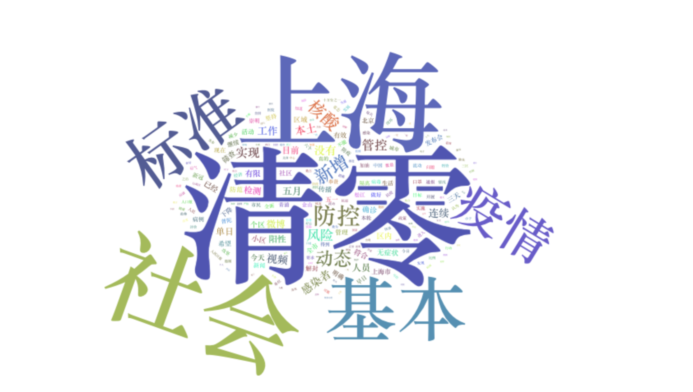

```{r setup, include=FALSE}
knitr::opts_chunk$set(echo = TRUE)
options(tinytex.verbose = TRUE)
library(readr)
library(jiebaR)
library(tidyverse)
library(stringr)
library(quanteda)
library(quanteda.textstats)
library(quanteda.textplots)
library(quanteda.corpora)
library(ggplot2) # For plotting word frequencies
library(tidyverse)
library(wordcloud2)
library(keyATM)
library(tidytext)
library(webshot)
webshot::install_phantomjs()
```

## Brief substantive background / goal

On March 27, 2022, authorities in Shanghai, China, announced the decision to place the city under stringent lockdown after experiencing the largest COVID-19 outbreak since the onset of 2020. During the lockdown, residents were unable to leave their apartments, go to grocery stores or order food deliveries. Most had to rely on community group-buying, where residents at the same address bulk buy groceries from suppliers---often at significantly higher price than normal---to stay fed. As a result, social media saw an unprecedented level of discontent against China's COVID-zero policy. Some of those evolved into collective actions: As residents going into the second month of the lockdown in May, The Wall Street Journal [reported](https://www.wsj.com/articles/shanghai-residents-protest-lockdown-with-marches-smashed-vegetables-and-art-projects-11651483851) residents taking protests to the street through marches, smashed vegetables and art project. This leads me to the question: How does social media mediated collective actions under authoritarian regimes like China?

While I proposed the broad question of collective action as my B.A. thesis topic, I am interested in first exploring the feasibility of identifying dissents on Chinese social media. Given the widespread censorship that limits the availability of data on social media such as Sina Weibo (see [Lu et.al. (2021)](http://jenpan.com/jen_pan/covid.pdf) for analysis on censorship on Sina Weibo during COVID-19), a pilot project is necessary to ensure the validity of data. In this project, I collect and analyse social media contents during the COVID-19 lockdown in Shanghai with two goals. First, I aim to identify the topics that are frequently discussed on social media when it comes to COVID-zero policy. Second, I hope to test different segmentation methods on Chinese texts. As we know, pre-processing non-English texts poses challenges such as tokenizing the wrong words and choosing stopwords. In this project, I experiment with [Jieba](https://github.com/fxsjy/jieba) and [Quanteda](https://www.quanteda.com/) and attempt find a way that combines those two methods in data cleaning.

## Collecting data

I collect data from Sina Weibo, the largest, Twitter-like social media used in China. For the purpose of this project, I only use the tweets from May 1 for two reasons: First, it was the day where the officials announced that the city reached "community-level zero COVID" in six districts, meaning that all COVID patients are under collective quarantine. Second, the translation package I used has a 500,000 character quota per month, which is close to the character length of May 1 tweets I collected. For the purpose of comparison, it is only useful to include this dataset.

Since the native Weibo API is only available to Sina's partner organizations, I use a [program](https://github.com/dataabc/weibo-search) based on Python's web-crawling network, Scrapy. This allows me to search all tweets on Weibo by keyword and date range. Using this method, my final corpus includes 4,809 tweets from May 1, 2022 with the keyword "清零(COVID-zero)". One limitation of this method is that it does not distinguish between tweets from state media and tweets from the public, where the former generally holds a supportive attitude towards the policy and speaks in official tone, which might affect the validity of the data. In addition, the word "清零" literally means "turning zero" in Chinese, so there might be tweets that are not directly related to COVID in this corpus. 

## Cleaning / pre-processing data

To compare the different packages, I use `JiebaR` and `Quanteda` to pre-process the data. First, to compare how they work differently without defining any removal of symbols, stopwords and punctuations, I run the default segmentation for each tweet on the same corpus. For `JiebaR`, this has to be done in two steps: 1) Initialize a JiebaR worker, an engine for word segmentation. Here, I specify `my_seg = worker(byline = TRUE)` which returns the result by lines of input files, i.e. by each tweet in this case. 2) Run `jieba_tokens = segment(text, my_seg)` on the text. For `Quanteda`, this is done with `corpus(text)`. Then I plot the summaries of both corpora, visualizing the number of tokens in each document according to each segmentation method. 

```{r images, echo=FALSE,out.width="49%",out.height="20%",fig.show='hold',fig.align='center'}

knitr::include_graphics(c("project_files/jieba_corpus.png","project_files/quanteda_corpus.png"))
```
I set the bin width of the histogram to 20. From the graph, there is not a significant difference between the distribution of the number of tokens, but there seems to be a greater number of tweets with 20-40 tokens using Jieba and slightly more tweets with more than 40 tokens using Quanteda. See the tokenized first tweet as an example:

- Original Tweet: "无语了。。这都能清零是吧。。。" (*Translation: Speechless..Even this can turn zero right...*) 
- Quanteda: "无"   "语"   "了"   "。"   "。"   "这"   "都能" "清"   "零"   "是"   "吧"   "。"   "。"   "。"  
- JiebaR: "无语" "了"   "这"   "都"   "能"   "清零" "是"   "吧"  

Quanteda tokenizes mostly by single characters and compromises Chinese words that mostly consist of two characters. For example, the word "无语(speechless)" was segmented into two separate characters by Quanteda, like the word "清零(COVID-zero)". In addition, it looks like that Jieba automatically removes all punctuations while Quanteda treats each period(。) as a token. For our purpose, it's important to retain the full words like COVID-zero.

To retain only the useful information from the tweets, I take a few more steps with the JiebaR worker. Because Chinese text includes a different set of stopwords, I create a separate document that includes stopwords for simplified Chinese and punctuation marks. The new engine is: `my_seg <- worker(bylines = T, stop_word = "stopwords-zh.txt", symbol = F)`. I also defined a list of delimiters to remove: `CHUNK_DELIMITER <- "[，。！？；：\n]+"`. This allows me to create a tokenized object for further analysis.

## Analysis and visualization

- **Keyword in Context**

I use keyword-in-context displays from Quanteda to understand words concordancing with "COVID-zero." Through searching the pattern "\*清零\*(COVID-zero)" using the `kwic()` function and specifying `window=1` to limit the result of one token, I found that the word used before and after "COVID-zero" is "基本(almost)" and "标准(standard)", which occurs 3,494 and 2,687 times respectively in 4,809 total tweets. After increasing the `window=` argument, I found that the context of "COVID-zero" generally falls within official languages that describe what it means to achieve community-level zero COVID in Shanghai. It does not give much context of community concerns and discontent over COVID-zero because, while those tweets might consist of a large amount, they generally don't follow a particular pattern like state-affiliated news media or state agencies would tweet. 

- **Word Frequency**

Second, I look at the word frequency in this corpus. Notice that the corpus is loaded as a text-based dataframe in the data cleaning process, so I use `tidytext::unnest_tokens()` to first create a line token object where each line from a tweet is a token. Then I use the `JiebaR` segmentation defined before to tokenize each word. After calculating the frequency of occurrence of each word, I create the following word cloud using `wordcloud(2)`. 



While the word cloud is in Chinese, it's still possible to identify that only a few keywords occur in high frequency through the size of the words. The largest one is obviously "清零(COVID-zero)" because it's the keyword used in searching for the tweets. After "COVID-zero", the words that occur more than 1,000 times are (by descending order): 上海(Shanghai)，社会面(community-level)、基本(basic/almost)、标准(standard)、疫情(pandemic)、防控(prevention and control)、新增(increase)、动态(dynamic)、核酸(COVID-19)。It's especially worth noticing that Shanghai appears as the second most common word, meaning that most discussions are about the city's lockdown. Other words that occur greater than 100 times include "hope", "life", "residential compound", "work" — all related to life under lockdown. 

To validate the accuracy of the list and help with topic modeling, I also run [snownlp](https://github.com/isnowfy/snownlp) library in Python which is designed for processing Chinese texts and has a function that extracts keywords from a text. This program has its own segmentation method but does not identify Chinese words as well as Jieba, thus I use it as a supplement. To find the keywords, I iterate through each line of my original dataset and identify only Chinese and English characters by specifying the Unicode `unicodedata.category(c).startswith('L')`. This means that I filter out all emojis, punctuations, symbols and numbers as I did with Jieba. I then combine all tweets into one unordered string and use `SnowNLP` to extract 100 keywords. After comparing the keywords from `SnowNLP` and the frequent words from the `JiebaR` tokenization, I manually identify four topics for my next topic model. 

- **Keyword Assisted Topic Model**

I use the `keyATM` package to fit a Keyword Assisted Topic Model. The four topics I identify are: Government, Lockdown, COVID, Supplies. When fitting the model, I specify four additional topics without keywords that the model would help me find. The top ten words for each topics from the model are as follows:

```{r code, echo=FALSE}
# load data
data <- read.csv("结果文件/清零/清零.csv")
# select columns needed
newdata <- data %>%
  select(c(`发布时间`,`微博正文`,`点赞数`)) %>%
  mutate(date = substr(`发布时间`,1,10)) %>%
  select(-c(`发布时间`))
# date format
newdata$date <- as.Date(newdata$date)
# filter date for May 1
newdata <- newdata %>% filter(date=="2022-05-01")
newdata$index <- 1:nrow(newdata)
CHUNK_DELIMITER <- "[，。！？；：\n]+"
my_seg <- worker(bylines = T,
                 # use user-defined stopwords
                 stop_word = "stopwords-zh.txt",
                 symbol = F)

# token
newdata$微博正文 %>%
  map(str_split, pattern=CHUNK_DELIMITER,simplify=TRUE) %>%
  map(segment,my_seg) %>%
  map(unlist) %>%
  as.tokens() -> weibo_tokens
```

```{r csv, echo=FALSE,message=FALSE}
# create dfm
data_dfm <- dfm(weibo_tokens)

# read data
keyATM_docs <- keyATM_read(texts = data_dfm)

# process keywords
keywords <- list(Government = c("国家","发展","政策","中国","经济"),
                 Lockdown = c("上海","出","小区","生活","封","隔离"),
                 COVID = c("病毒","新冠","新增","阳性","感染"),
                 Supplies = c("人民","物资","生活","希望","工作"))

# fit the model
out <- keyATM(docs              = keyATM_docs,    # text input
              no_keyword_topics = 4,              # number of topics without keywords
              keywords          = keywords,       # keywords
              model             = "base",         # select the model
              options           = list(seed = 250))

# keywords by topics
df_out <- top_words(out)
print(df_out)

# translation
trans <- read.csv("trans.csv")
knitr::kable(trans)
```

An interesting finding from the model is that there are a few additional topics not so much related to COVID per se. For example, the second additional model includes mostly words like "good luck", "luck", and "May", but "COVID-zero" is still part of the topic, meaning that there are some tweets detailing individual wishes for the coming month. Similarly, the fourth additional model includes words such as "happy" and "luck." However, there are not many topics suggesting uprising discontent or dissent towards the government. In addition, some of the topics that the model estimated overlap with each other, meaning that this data set might not have enough data for us to differentiate different topics from each other.

## Future work
The most significant limitation with this project is the timeframe. In this case, data from one specific day is not enough to draw particularly meaningful conclusions. Turning from online dissents to collective actions offline is a prolonged process that involves organizing and public reception, thus it is necessary to analyze data from at least the entirely of the lockdown period (i.e. from March to May) for insights on collective actions during one specific event. Ideally, we would be able to run the same process on Chinese social media data from February 2020 to 2022, which would allow us to draw conclusions about how social media discourses change throughout the pandemic. 

To address the issues with media tweets that interfere with the results from public tweets, the weibo-search program based on Scrapy allows us to specify the kind of tweets to scrape (but does not include a parameter of the kind of tweets ad-hoc). We might be able to retrieve the entire dataset and substract a subset of media tweets. This also allows us to analyze how state media's framing of COVID-zero policy changes overtime if we are able to scrape the data from 2020 to today.

One challenge with collecting data from 2020 is that we are only able to use post-censorship data. While those might still provide meaningful conclusions due to the large quantity of tweets (as we are able to collect almost 5,000 tweets from only one day), the tweets that have the greatest potentials to lead to collective actions are likely censored. Because of the [stability maintenance](https://www.worldscientific.com/doi/10.1142/S1013251121500028) regime in China, tweets that have the greatest impacts among netizens are also the tweets that easily catch authorities' attentions. In addition, the prevalance self-censorship might cause users to avoid tweeting about COVID policy using the phrasing itself. This means that they might use emoticons and telegraph codes to [skirt](https://www.brookings.edu/techstream/skirting-chinese-censorship-with-emoticons-and-telegraph-codes/) government censorship, making it harder to researchers to identify those tweets. 

One alternative I proposed for my thesis is that we can scrap all tweets regardless of keywords, and use existing machine learning mechanisms to identify tweets that potentially discuss collective actions. To limit the data within a reasonable range, we can also build a scraper that collects all tweets from today, which means that the data set includes only pre-censorship tweets. This also allows us to control for censorship and understand such mechanism. 

In terms of methodology, this project shows key insights of existing text segmentation algorithms when processing Chinese texts. `Jieba` offers a fairly native segmentation for Chinese words, but it does not include most other features in Quanteda such as existing stopwords and punctuation removal, as well as analytic frameworks based on Quanteda. To use `Jieba`, the best practice might be to combine the program with other algorithms and to add more words related to the topic of research. This is especially useful in Chinese context because state media often create "official phrases" when it comes to public crisis like COVID. 

*To see the scripts used for this project, click [here](https://github.com/ywlu026/weibo-covid).*